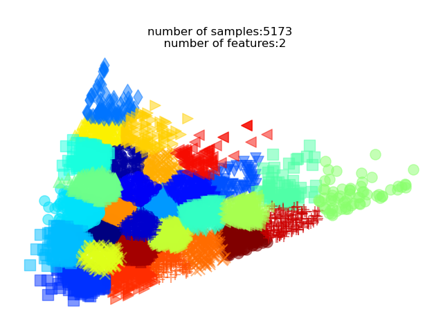

# predict-photographer-editing-style

## overview

- Goal: create a model that can predict the editing style of a photographer based on their images
- Data:
  - ~7000 images
    from [Cats and Dogs Breeds Classification Oxford Dataset](https://www.kaggle.com/c/dogs-vs-cats/data) (downloaded
    from [here](https://www.kaggle.com/c/dogs-vs-cats/data))
  - artificial data create by splitting the global image into 30 different photographers

## What this repository do? 🚀

### Setup

- run function `create_image_features_df()` in file [images_autoencoder.py](images_autoencoder.py) to create a dataframe
  with the features of the images divided artificial in 30 different photographers by clustering the images global
  features space with KMeans

### Model 1: Autoencoder

- creates an autoencoder model to reduce the dimensionality of the image by using pixels values and global features as
  loss between input and output images ([images_autoencoder.py](images_autoencoder.py))

### Model 2: global feature predictor by photographer

- create a random initial tensor with 3 (photographers embedding space dimensionality) over N (number of unique
  photographers)
- create a mixed model that uses the output of the embedding layer of the autoencoder as input concatenated with the
  random photographers embedding tensor
- enable gradients on both the model weights and the photographer embeddings
- trains the model to predict the editing style of the photographer based on the image
- we have created two things here:
    - a model that can predict the editing style of a photographer based on their images
    - and a photographers embedding space that can be used to various tasks

## images embedding space example in 2D projection (using PCA)

*images embedding space example in 2D projection (using PCA)*

data set used is [Cats and Dogs Breeds Classification Oxford Dataset](https://www.kaggle.com/datasets/zippyz/cats-and-dogs-breeds-classification-oxford-dataset)

[Alt Text](assets/ezgif.com-gif-maker.gif)

- as the steps progress the embedding space is getting more and more stable

##        

- the embedding space is divided into 30 clusters (photographers) using k-means clustering algorithm, this is the artificial ground truth for the model we are generating

## How to use it? 🤔

- setup conda env and install requirements by running `pip install -r requirements.txt` in your terminal
- download the dataset from [Cats and Dogs Breeds Classification Oxford Dataset
  ](https://www.kaggle.com/datasets/zippyz/cats-and-dogs-breeds-classification-oxford-dataset)
- run the script [images_autoencoder.py](images_autoencoder.py) to create the autoencoder model and images embeddings

