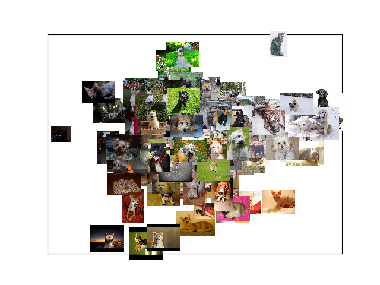

# predict-photographer-editing-style

## images embedding space example in 2D projection (using PCA)

data set used is [Cats and Dogs Breeds Classification Oxford Dataset
](https://www.kaggle.com/datasets/zippyz/cats-and-dogs-breeds-classification-oxford-dataset)

[Alt Text](assets/ezgif.com-gif-maker.gif)

## What this repository do? 🚀

- creates an autoencoder model to reduce the dimensionality of the image by using pixels values and global features
-

## How to use it? 🤔

- setup conda env and install requirements by running `pip install -r requirements.txt` in your terminal
- download the dataset from [Cats and Dogs Breeds Classification Oxford Dataset
  ](https://www.kaggle.com/datasets/zippyz/cats-and-dogs-breeds-classification-oxford-dataset)
- run the script [images_autoencoder.py](images_autoencoder.py) to create the autoencoder model and images embeddings
-
- 

