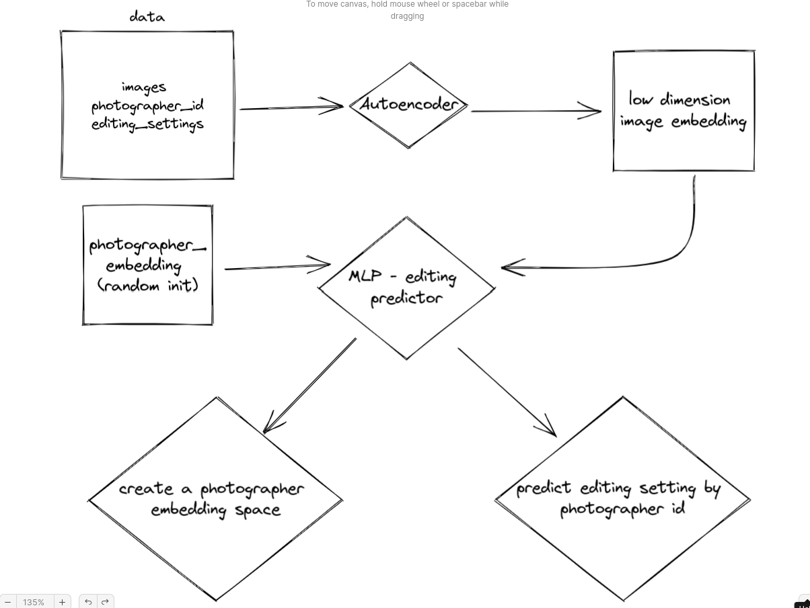

# predict-photographer-editing-style

## overview

- Goal: create a model that can predict the identity of the photographer by analysing the editing style of their edited photographs
- Data:
  - ~7000 images (we can use much less for testing purposes)
    from [Cats and Dogs Breeds Classification Oxford Dataset](https://www.kaggle.com/c/dogs-vs-cats/data) (downloaded
    from [here](https://www.kaggle.com/c/dogs-vs-cats/data))
  - artificial labels created by splitting image (by their global features) into 30 different clusters that are corresponded to photographers (see below function `create_image_features_df()` )

## What this repository do? 🚀

### Setup
- install python 3.8
- install CUDA
- setup conda env and install requirements by running `pip install -r requirements.txt` in your terminal
- download the dataset from [Cats and Dogs Breeds Classification Oxford Dataset and save it to the "./data" repository
- run function `create_image_features_df()` in file [images_autoencoder.py](images_autoencoder.py) to create a dataframe
  with the features of the images divided artificial in 30 different photographers by clustering the images global
  features space with KMeans
### System design

### Model 1: AutoEncoder

- creates an autoencoder model to reduce the dimensionality of the images by using both pixels values and global features as
  loss between input and output images 
- run main in [images_autoencoder.py](images_autoencoder.py)
  - create and train an AutoEncoder 
  - save encoder for later use
  - monitor training process with TensorBoard
- the result is an encoder that can encode new images in a latent we created

### Model 2: global feature predictor by photographer

- run main in [user_predictor.py](user_predictor.py)
  - create a random initial tensor with 3 (photographers embedding space dimensionality) over N (number of unique
    photographers)
  - create a mixed model that uses the output of the embedding layer of the AutoEncoder as input concatenated with the
    random photographers embedding tensor
  - enable gradients on both the model weights and the photographer embeddings (the last layer in the network)
  - trains the model to predict the editing style of the photographer based on the image
  - we have created two things here:
      - a model that can predict the editing style of a photographer based on their images
      - a photographers embedding space that can be used to various tasks (such as find similar photographers...)

*images embedding space example in 2D projection (using PCA)*

---

  

*as the steps progress the embedding space is getting more and more stable*

---

*the embedding space is divided into 30 clusters (photographers) using k-means clustering algorithm, this is the artificial ground truth for the model we are generating*

